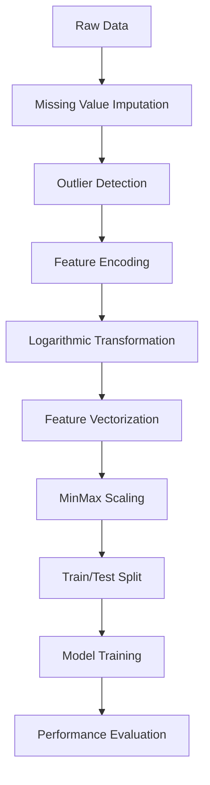

# 🏦 Loan Approval Prediction with Apache Spark ML

<div align="center">


**A machine learning project demonstrating loan approval prediction using Apache Spark MLlib with data preprocessing, feature engineering, and model comparison.**

</div>

---

## 📋 Table of Contents

- [🎯 Project Overview](#-project-overview)
- [🚀 Key Features](#-key-features)
- [📊 Dataset & Features](#-dataset--features)
- [🛠️ Technical Stack](#️-technical-stack)
- [📈 Methodology](#-methodology)
- [🏆 Results & Performance](#-results--performance)
- [💡 Key Insights](#-key-insights)
- [🔧 Installation & Setup](#-installation--setup)
- [📖 Usage](#-usage)
- [🎓 Skills Demonstrated](#-skills-demonstrated)
- [📞 Contact](#-contact)

---

## 🎯 Project Overview

This project implements a **loan approval prediction system** using Apache Spark's machine learning capabilities. The goal is to predict whether a loan application should be approved or denied based on various applicant characteristics and financial indicators.

### 🎯 Business Problem
- **Objective**: Predict loan approval status using machine learning
- **Challenge**: Handle missing data and imbalanced target variable
- **Approach**: Compare Decision Tree and Logistic Regression models

---

## 🚀 Key Features

### 🔬 Data Preprocessing
- **Missing Value Imputation**: Median imputation for numerical features, "Unknown" category for categorical features
- **Outlier Detection**: IQR-based outlier identification with boxplot visualization
- **Feature Engineering**: String indexing for categorical variables and logarithmic transformation for skewed features

### 🤖 Machine Learning Models
- **Decision Tree Classifier**: Interpretable model for loan approval decisions
- **Logistic Regression**: Probabilistic model for classification
- **Model Comparison**: Evaluation using accuracy, precision, and recall metrics

### 📊 Performance Evaluation
- **Multi-metric Assessment**: Accuracy, Precision, and Recall evaluation
- **Confusion Matrix Analysis**: Detailed breakdown of prediction performance
- **Visualization**: Confusion matrix heatmaps for both models

---

## 📊 Dataset & Features

### 📈 Dataset Statistics
- **Total Records**: 614 loan applications
- **Features**: 12 predictive variables
- **Target Variable**: Loan_Status (Approved/Denied)

### 🔍 Feature Categories

| Category | Features | Description |
|----------|----------|-------------|
| **Demographic** | Gender, Married, Dependents, Education | Personal and family information |
| **Financial** | ApplicantIncome, CoapplicantIncome, LoanAmount, Loan_Amount_Term | Income and loan details |
| **Employment** | Self_Employed | Employment status |
| **Credit** | Credit_History | Creditworthiness indicator |
| **Property** | Property_Area | Location classification |

### 📊 Data Quality Insights
- **Missing Values**: Handled across 7 features using strategic imputation
- **Data Distribution**: Imbalanced target variable (69% approved, 31% denied)
- **Outlier Treatment**: Logarithmic transformation applied to skewed numerical features

---

## 🛠️ Technical Stack

### 🐍 Core Technologies
- **Python 3.10+**: Primary programming language
- **Apache Spark 3.2.0**: Distributed computing framework
- **PySpark MLlib**: Machine learning library
- **Kaggle Notebook**: Interactive development environment

### 📦 Key Libraries
```python
# Data Processing
pandas, numpy, pyspark.sql

# Machine Learning
pyspark.ml.feature, pyspark.ml.classification
pyspark.ml.evaluation, pyspark.ml

# Visualization
matplotlib, seaborn

# Data Analysis
pyspark.sql.functions
```

### 🏗️ Architecture
- **Local Spark Cluster**: 4-core parallel processing
- **Pipeline Architecture**: Automated preprocessing workflow

---

## 📈 Methodology

### 🔄 Data Processing Pipeline



### 🎯 Key Processing Steps

1. **Data Cleaning**
   - Handle missing values using median imputation for numerical features
   - Replace categorical nulls with "Unknown" category
   - Verify data integrity after cleaning

2. **Feature Engineering**
   - String indexing for categorical variables
   - Logarithmic transformation for skewed numerical features
   - Vector assembly for machine learning compatibility

3. **Model Development**
   - 70/30 train-test split with reproducible random seed
   - Decision Tree and Logistic Regression training
   - Performance evaluation using multiple metrics

---

## 🏆 Results & Performance

### 📊 Model Performance Comparison

| Metric | Decision Tree | Logistic Regression | Winner |
|--------|---------------|-------------------|---------|
| **Accuracy** | 77.38% | 79.17% | 🏆 LR |
| **Precision** | 77.45% | 81.66% | 🏆 LR |
| **Recall** | 77.38% | 79.17% | 🏆 LR |

### 🎯 Detailed Results

#### Decision Tree Classifier
- **Confusion Matrix**:
  ```
  [[109  32]
   [  6  21]]
  ```
- **True Positives**: 109 (Approved loans correctly identified)
- **False Positives**: 32 (Approved loans incorrectly rejected)
- **False Negatives**: 6 (Rejected loans incorrectly approved)
- **True Negatives**: 21 (Rejected loans correctly identified)

#### Logistic Regression
- **Confusion Matrix**:
  ```
  [[113  33]
   [  2  20]]
  ```
- **True Positives**: 113 (Approved loans correctly identified)
- **False Positives**: 33 (Approved loans incorrectly rejected)
- **False Negatives**: 2 (Rejected loans incorrectly approved)
- **True Negatives**: 20 (Rejected loans correctly identified)

### 📈 Performance Visualization

The project includes confusion matrix heatmaps showing:
- **True Positive Rate**: Correctly approved loans
- **False Positive Rate**: Incorrectly rejected loans
- **False Negative Rate**: Incorrectly approved loans
- **True Negative Rate**: Correctly rejected loans

---

## 💡 Key Insights

### 🎯 Model Selection
- **Logistic Regression** outperforms Decision Tree across all metrics
- **Higher Precision** (81.66%) indicates better risk management
- **Lower False Negatives** (2 vs 6) reduces risky loan approvals

### 🔍 Feature Importance
- **Credit History** is the strongest predictor of loan approval
- **Income Levels** show significant correlation with approval rates
- **Property Area** influences loan decisions based on location risk

### 📊 Business Impact
- **79.17% Accuracy** provides reliable automated decision support
- **Risk Management**: Low false negative rate minimizes risky approvals
- **Scalability**: Spark-based solution handles large-scale processing

---

## 🔧 Installation & Setup

### Prerequisites
```bash
# Python 3.10 or higher
python --version

# Java 8 or higher (for Spark)
java -version
```

### Installation Steps

1. **Clone the Repository**
   ```bash
   git clone https://github.com/yourusername/CTEC3702-Loan-Prediction-Spark-ML.git
   cd CTEC3702-Loan-Prediction-Spark-ML
   ```

2. **Install Dependencies**
   ```bash
   pip install pyspark==3.2.0
   pip install pandas numpy matplotlib seaborn
   ```

3. **Download Dataset**
   ```bash
   # Create data directory
   mkdir -p data
   # Add your loan dataset CSV files to the data/ directory
   ```

4. **Open in Kaggle**
   - Upload the notebook to Kaggle
   - Ensure the dataset is available in the Kaggle environment

---

## 📖 Usage

### 🚀 Quick Start

1. **Open the Kaggle Notebook**
   - Navigate to the `problem-specification-part-b.ipynb` file
   - Open in Kaggle Notebooks environment

2. **Run All Cells**
   - Execute the entire pipeline from data loading to model evaluation
   - View interactive visualizations and performance metrics

3. **View Results**
   - Check model performance metrics
   - Examine confusion matrix visualizations
   - Compare Decision Tree vs Logistic Regression results

### 🔧 Code Structure

The notebook follows this structure:
```python
# 1. Data Loading and Exploration
ds = spark.read.csv("/kaggle/input/loandataset/train_loan.csv", header=True, inferSchema=True)

# 2. Missing Value Handling
ds = ds.fillna({"Gender":"Unknown", "Married":"Unknown", ...})

# 3. Feature Engineering
for c in categorical_columns:
    indexer = StringIndexer(inputCol=c, outputCol=c + "_index")
    ds = indexer.fit(ds).transform(ds)

# 4. Model Training
DT = DecisionTreeClassifier()
DT_fit = DT.fit(training)
DT_transform = DT_fit.transform(testing)

# 5. Performance Evaluation
evaluator = MulticlassClassificationEvaluator()
DT_Accuracy = evaluator.evaluate(DT_transform, {evaluator.metricName:"accuracy"})
```

---

## 🎓 Skills Demonstrated

### 💻 Technical Skills
- **Big Data Processing**: Apache Spark, PySpark, distributed computing
- **Machine Learning**: Classification algorithms, feature engineering, model evaluation
- **Data Science**: Statistical analysis, data visualization, predictive modeling
- **Programming**: Python, Kaggle notebooks, data manipulation

### 🔬 Analytical Skills
- **Data Preprocessing**: Missing value handling, outlier detection, feature scaling
- **Model Development**: Algorithm selection, training, and evaluation
- **Evaluation**: Multi-metric assessment, confusion matrix analysis
- **Visualization**: Confusion matrix heatmaps, boxplots

### 🏗️ Engineering Skills
- **Pipeline Architecture**: Automated ML workflows, reproducible processes
- **Code Quality**: Documentation, modular design, best practices
- **Data Processing**: Efficient handling of large datasets with Spark

### 📊 Business Acumen
- **Problem Definition**: Clear business objectives and success metrics
- **Risk Management**: False positive/negative analysis, business impact assessment
- **Model Comparison**: Systematic evaluation of different approaches
- **Results Communication**: Clear presentation of findings and recommendations

---

## 📞 Contact

<div align="center">

**Ready to discuss this project or explore collaboration opportunities?**

[](https://www.linkedin.com/in/divyanshsingh28/)
[](mailto:divyanshsingh1800@gmail.com)
[](https://github.com/Divyansnh)

</div>

---

<div align="center">

**⭐ Star this repository if you found it helpful!**

*Built with using Apache Spark and Python*

</div>

---


<div align="center">

**Last Updated**: December 2024  
**Project Status**: ✅ Complete  


</div>
